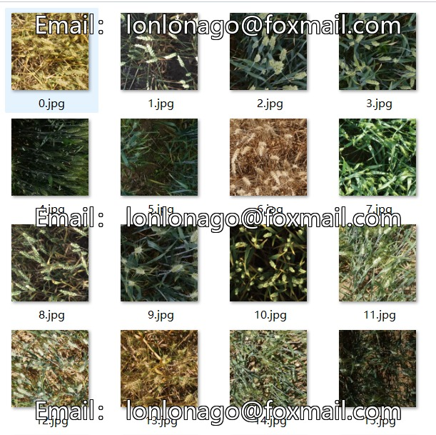
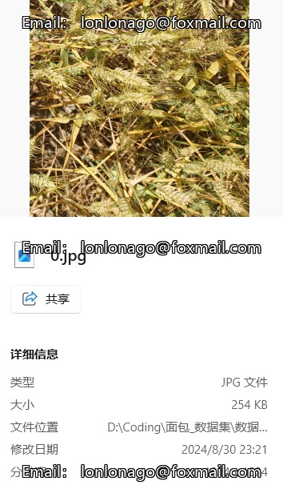
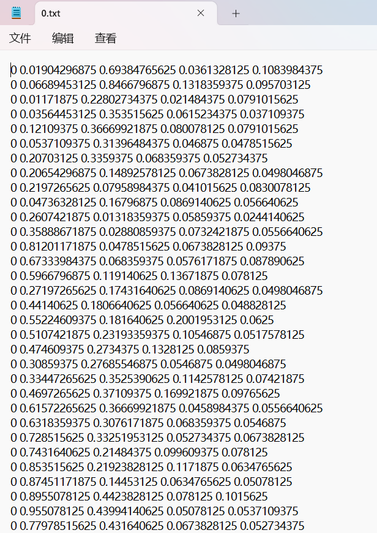
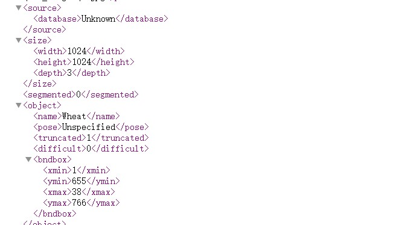
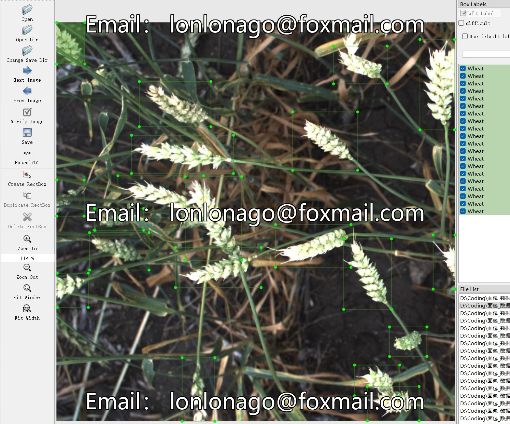

# Wheat Detection and Counting - Target Detection Dataset

Dataset Information Introduction: The dataset consists of a total of 3,373 images and corresponding annotation files. There are two types of annotation files, including VOC formatted xml files and YOLO formatted txt files. The annotation targets include the following:
- ['Wheat']
The number of bounding box information is as follows: (Annotations are usually labeled in English, with Chinese provided in square brackets for reference)
- Wheat: 147,792
Note: In one image, multiple objects may be labeled, so the total number of bounding boxes might be greater than the total number of images.
The complete dataset includes three folders and one txt file:
- all_images: Stores the dataset's images, screenshots included:
Image size information:
- all_txt folder and classes.txt: Stores the yolo formatted txt annotation files, in the same quantity as the images, each annotation file corresponds to an image.
- classes.txt:
For a detailed understanding of the standard format of the yolo file, please search for it on your own. In short, the index 0 in the array represents the name at the position 0 in the array in the classes.txt file.
- all_xml: A VOC formatted xml annotation file.
The quantity matches that of the images, each annotation file corresponds to an image.
For a detailed understanding of the standard format of the VOC file, please search for it on your own.
Both formats of annotation can be used, choose one of them accordingly.
Annotation effect screenshots:

## Images

Here is a pay link on Stripe ( https://buy.stripe.com/3cs8yP7sY87d0vu9AB ). Please contact me lonlonago@foxmail.com after funding $89, and I will send you a complete data files , thank you!

